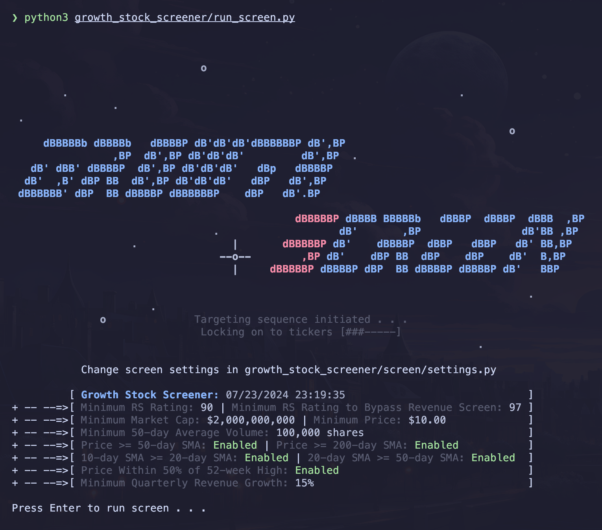

# Growth-Stock-Screener

An automated stock screening system which isolates and ranks top-tier growth companies based on relative strength, liquidity, trend, revenue growth, and institutional demand.

### Features:

- _Five_ distinct [screen iterations](#screen-iterations) based on time-tested criteria for predicting super-performance.
  - RS Rating calculations using methodology from [William O'Neil Securities](https://www.williamoneil.com/proprietary-ratings-and-rankings/).
  - Stage-2 uptrend criteria derived from strategies of U.S. investing champions Mark Minnervini and Oliver Kell.
  - Revenue growth sourced directly from the SEC's EDGAR [XBRL data APIs](https://www.sec.gov/edgar/sec-api-documentation).
- _Customizable_ screen [settings](growth_stock_screener/screen/settings.py) for fine-tuning.
- _Rapid_ web scraping using asynchronous requests.
  - Utilization of [aiohttp](https://docs.aiohttp.org/en/stable/) and multithreaded [Selenium](https://docs.aiohttp.org/en/stable/) browsers for concurrent data extraction.
- _Parsable_ [JSON outfiles](growth_stock_screener/json/README.md) for evaluation of screen criteria.
- _Colorful_ logging in the terminal.
- _Easy-to-access_ .csv outfiles to store screen results.

## Installation

#### Prerequisites

First, ensure that you have [Python 3.11+](https://www.python.org/) and [Firefox](https://www.mozilla.org/en-US/firefox/new/) installed.

> **_Note for Linux users:_** _the 'snap' version of Firefox that comes pre-installed may cause issues when running Selenium. To troubleshoot, follow [these instructions](https://www.omgubuntu.co.uk/2022/04/how-to-install-firefox-deb-apt-ubuntu-22-04) to install Firefox via 'apt' (not snap)._

Next, navigate to the directory where you would like to install the screener, and run the following commands in a terminal application:

#### Clone the Growth-Stock-Screener Repository:

```bash
git clone https://github.com/starboi-63/growth-stock-screener.git
```

#### Navigate to the Root Directory:

```bash
cd growth-stock-screener
```

#### Install Python Dependencies:

```bash
pip3 install -r requirements.txt
```

## Usage

#### Run Screen:

To run the screener, execute the following command from the root directory of the repository.

```bash
python3 growth_stock_screener/run_screen.py
```

#### Modify Screen Settings:

To customize screen settings, modify values in [settings.py](growth_stock_screener/screen/settings.py).

#### Viewing Results:

Screen results are saved in .csv format in the project root directory, and can be opened with software like Excel.


## Screen Iterations

An initial list of stocks from which to screen is sourced from _NASDAQ_.


Then, the following screen iterations are executed sequentially:

### Iteration 1: Relative Strength

The market's strongest stocks are determined by calculating a raw weighted average percentage price change over the last $12$ months of trading. A $40\\%$ weight is attributed to the most recent quarter, while the previous three quarters each receive a weight of $20\\%$.

$$\text{RS (raw)} = 0.2(Q_1\ \\%\Delta) + 0.2(Q_2\ \\%\Delta) + 0.2(Q_3\ \\%\Delta) + 0.4(Q_4\ \\%\Delta)$$

These raw values are then assigned a _percentile rank_ from $0\to 100$ and turned into _RS ratings_. By default, only stocks with a relative strength rating greater than or equal to $90$ make it through this stage of screening.

### Iteration 2: Liquidity

All _micro-cap_ companies and _thinly traded_ stocks are filtered out based on the following criteria:

$$
\begin{aligned}
\text{Market Cap} &>= \$1\ \text{Billion}\\
\text{Price} &>= \$10\\
50\ \text{day Average Volume} &>= 100,000\ \text{Shares}
\end{aligned}
$$

### Iteration 3: Trend

All stocks which are not in a _stage-two_ uptrend are filtered out. A stage-two uptrend is defined as follows:

$$
\begin{aligned}
\text{Price} &>= 50\ \text{Day SMA}\\
\text{Price} &>= 200\ \text{Day SMA}\\
10\ \text{Day SMA} &>= 20\ \text{Day SMA} >= 50\ \text{Day SMA}\\
\text{Price} &>= 50\\%\ \text{of}\ 52\ \text{Week High}
\end{aligned}
$$

### Iteration 4: Revenue Growth

Only the most rapidly growing companies with _high revenue growth_ are allowed to pass this iteration of the screen. Specifically,
the percent increase in the most recent reported quarterly revenue versus a year ago must be at least $25\\%$; if available, the percent increase in the prior period versus the same quarter a year ago must also be at least $25\\%$. Revenue data is extracted from XBRL from company 10-K and 10-Q _SEC_ filings, which eliminates foreign stocks in the process.

The current market often factors in _future_ revenue growth; historically, this means certain exceptional stocks have exhibited super-performance _without_ having strong on-paper revenue growth (examples include NVDA, UPST, PLTR, AI, etc.). To ensure that these stocks aren't needlessly filtered out, a small exception to revenue criteria is added: stocks with an $\text{RS} \geq 97$ can bypass revenue criteria and make it through this screen iteration.

### Iteration 5: Institutional Accumulation

Any stocks with a _net-increase_ in institutional-ownership are marked as being under accumulation. Institutional-ownership is measured by the difference in total inflows and outflows in the most recently reported financial quarter. Since this information lags behind the current market by a few months, no stocks are outright eliminated based on this screen iteration.
